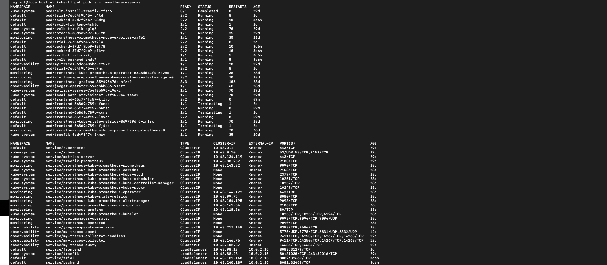
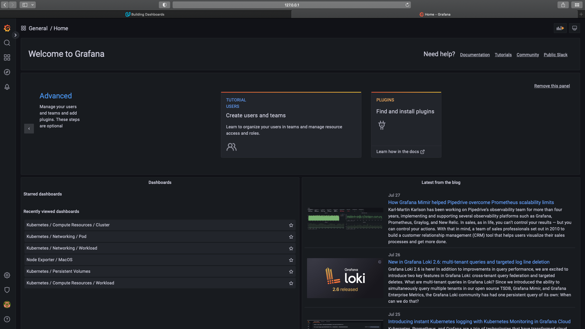
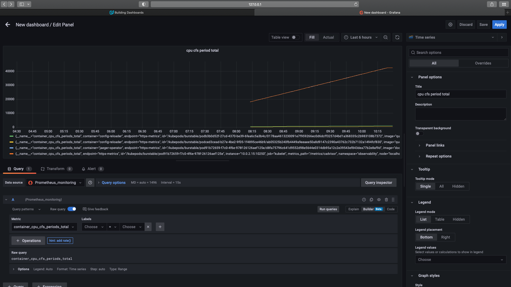
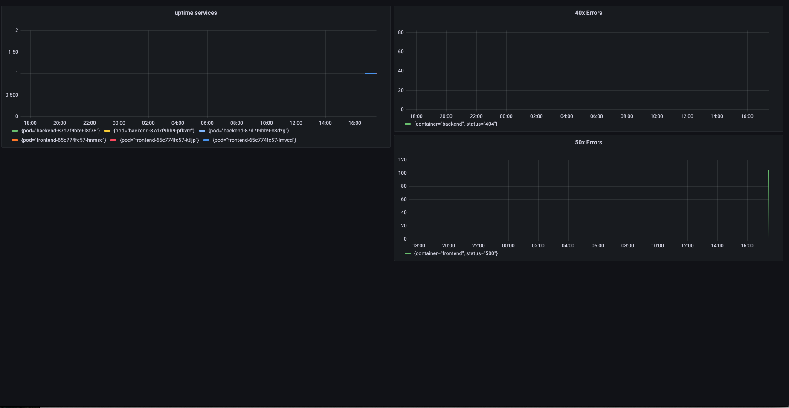
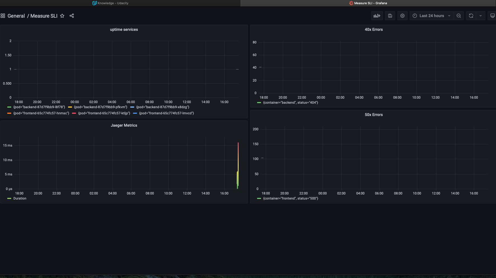
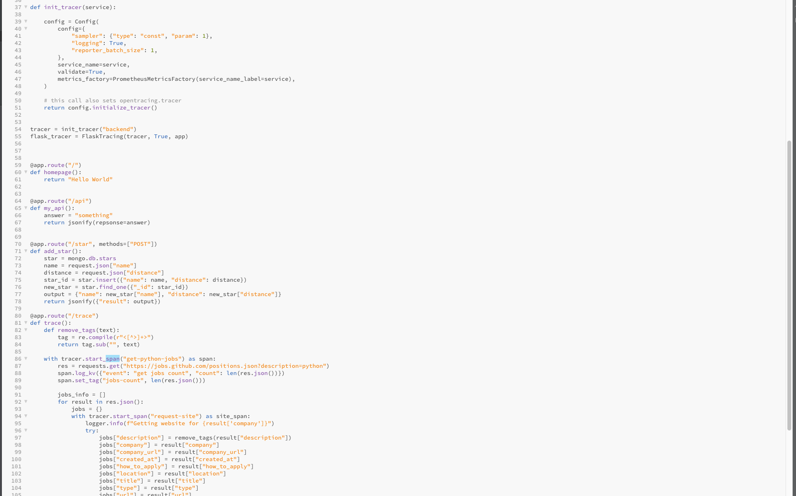
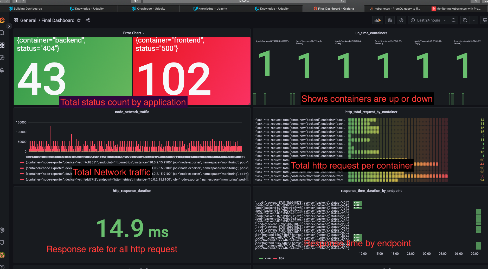
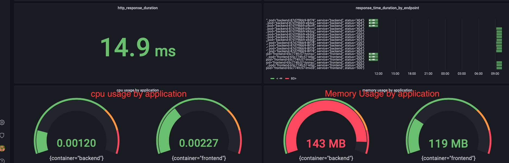

**Note:** For the screenshots, you can store all of your answer images in the `answer-img` directory.

## Verify the monitoring installation

*TODO:* run `kubectl` command to show the running pods and services for all components. Take a screenshot of the output and include it here to verify the installation

screenshot  

## Setup the Jaeger and Prometheus source
*TODO:* Expose Grafana to the internet and then setup Prometheus as a data source. Provide a screenshot of the home page after logging into Grafana.

screenshot  

## Create a Basic Dashboard
*TODO:* Create a dashboard in Grafana that shows Prometheus as a source. Take a screenshot and include it here.

screenshot  

## Describe SLO/SLI
SLO's are performance objectives which are measured internally. SLI's are specific metrics to measure SLOs monthly uptime and request response time. These metrics will help us determine if we are meeting SLOs for the application reliability and latency.

## Creating SLI metrics.

error - sum(flask_http_request_total{container=~"backend|frontend",status=~"403|404|410|500"}) by (status,container)
uptime container - sum(up{container=~"backend|frontend"}) by (pod)

node_network_traffic - rate(node_network_transmit_bytes_total[$__rate_interval])
http_total_request_by_container - flask_http_request_total{container=~"backend|frontend"}

response_duration -sum(rate(flask_http_request_duration_seconds_bucket[1m])) / sum(rate(flask_http_request_duration_seconds_count[1m]))
response_time_duration_by_endpoint - rate(flask_http_request_duration_seconds_sum{container=~"backend|frontend"}[$__rate_interval])

cpu_usage_by_application - sum by(container) (rate(container_cpu_usage_seconds_total{container=~"backend|frontend"}[1m]))
memory usage by application - sum by(container) (container_memory_usage_bytes{container=~"backend|frontend", namespace="default"})/1000000

## Create a Dashboard to measure our SLIs
*TODO:* Create a dashboard to measure the uptime of the frontend and backend services We will also want to measure to measure 40x and 50x errors. Create a dashboard that show these values over a 24 hour period and take a screenshot.

 

## Tracing our Flask App
*TODO:*  We will create a Jaeger span to measure the processes on the backend. Once you fill in the span, provide a screenshot of it here. Also provide a (screenshot) sample Python file containing a trace and span code used to perform Jaeger traces on the backend service.

 
 

## Jaeger in Dashboards
*TODO:* Now that the trace is running, let's add the metric to our current Grafana dashboard. Once this is completed, provide a screenshot of it here.

 

## Report Error
*TODO:* Using the template below, write a trouble ticket for the developers, to explain the errors that you are seeing (400, 500, latency) and to let them know the file that is causing the issue also include a screenshot of the tracer span to demonstrate how we can user a tracer to locate errors easily.

screenshot answer-img/report_error

TROUBLE TICKET

Name: frontend error

Date: 2022-08-26 09:06:55.947

Subject: frontend 500 error

Affected Area: get-python-jobs function

Severity:high

Description:

{
  "key": "pod.name",
  "type": "string",
  "value": "frontend-65c774fc57-ktljp"
}

{
  "key": "pod.namespace",
  "type": "string",
  "value": "default"
}

{
  "key": "error.kind",
  "type": "string",
  "value": "<class 'json.decoder.JSONDecodeError'>"
}

{
  "key": "message",
  "type": "string",
  "value": "Expecting value: line 1 column 1 (char 0)"
}

"  File "app.py", line 62, in trace
    span.log_kv({"event": "get jobs count", "count": len(res.json())})
  File "/usr/local/lib/python3.7/site-packages/requests/models.py", line 898, in json
    return complexjson.loads(self.text, **kwargs)
  File "/usr/local/lib/python3.7/json/__init__.py", line 348, in loads
    return _default_decoder.decode(s)
  File "/usr/local/lib/python3.7/json/decoder.py", line 337, in decode
    obj, end = self.raw_decode(s, idx=_w(s, 0).end())
  File "/usr/local/lib/python3.7/json/decoder.py", line 355, in raw_decode
    raise JSONDecodeError("Expecting value", s, err.value) from None
"

## Creating SLIs and SLOs
*TODO:* We want to create an SLO guaranteeing that our application has a 99.95% uptime per month. Name four SLIs that you would use to measure the success of this SLO.

SLI

Error
traffic
latency
saturation

## Building KPIs for our plan
*TODO*: Now that we have our SLIs and SLOs, create a list of 2-3 KPIs to accurately measure these metrics as well as a description of why those KPIs were chosen. We will make a dashboard for this, but first write them down here.

KPI's

Error chart - Shows number of error for given time period, gives instant snapshot so that admin can react to issue immediately.
Uptime_containers - Shows whether containers are active or not

network_traffic - shows network traffic and whether bandwidth is sufficient or not
http_total_request_by_container - shows http traffice handled by container and helps in determining if new containers need to be spun to handle the   traffic

http_response_duration - helps in determining if the request time is acceptable
response_time_duration_endpoint - gives response time by application end point

cpu_usage by application - gives cpu usage by each application
memory usage by application - gives memory usage by application in mb

## Final Dashboard
*TODO*: Create a Dashboard containing graphs that capture all the metrics of your KPIs and adequately representing your SLIs and SLOs. Include a screenshot of the dashboard here, and write a text description of what graphs are represented in the dashboard.  

The final dashboard gives snapshot of all key kpi in once place and helps in determining and troubleshooting any issue with the application

 
 
