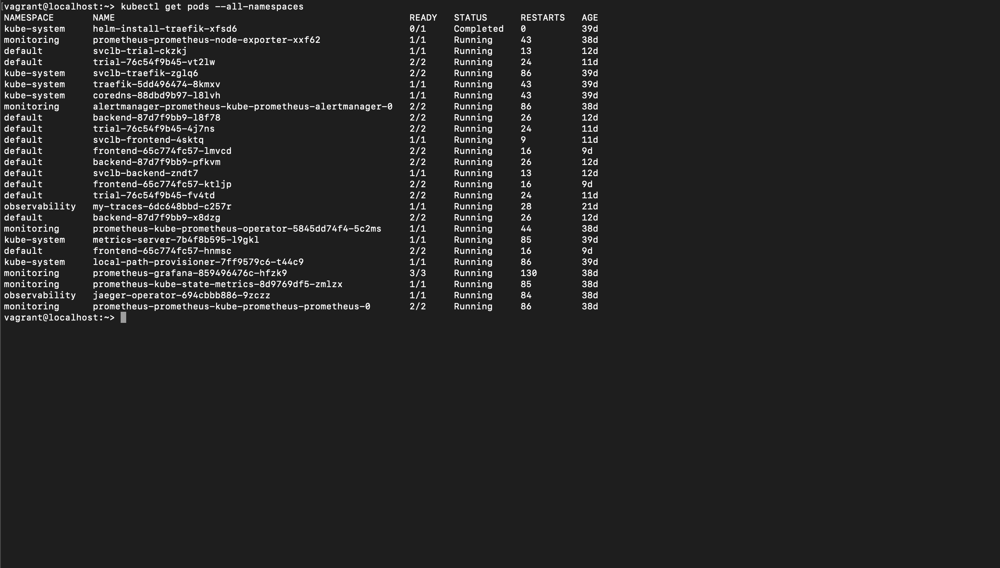
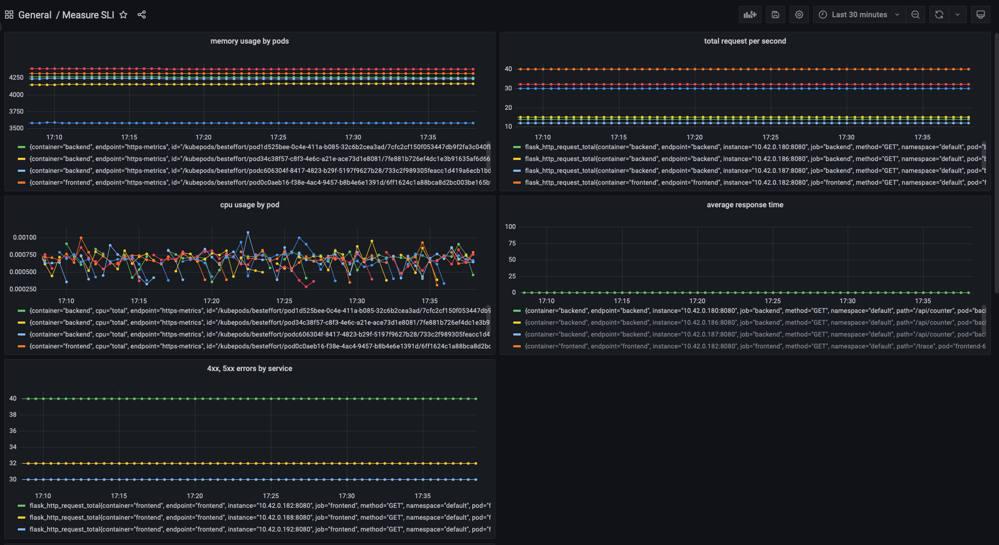

**Note:** For the screenshots, you can store all of your answer images in the `answer-img` directory.

## Verify the monitoring installation

*TODO:* run `kubectl` command to show the running pods and services for all components. Take a screenshot of the output and include it here to verify the installation

screenshot  

## Setup the Jaeger and Prometheus source
*TODO:* Expose Grafana to the internet and then setup Prometheus as a data source. Provide a screenshot of the home page after logging into Grafana.

screenshot  

## Create a Basic Dashboard
*TODO:* Create a dashboard in Grafana that shows Prometheus as a source. Take a screenshot and include it here.

screenshot  

## Describe SLO/SLI
SLO's are performance objectives which are measured internally. SLI's are specific metrics to measure SLOs monthly uptime and request response time. These metrics will help us determine if we are meeting SLOs for the application reliability and latency.

## Describe in detail 5 metrics to measure SLIs.

Five metrics to measure SLI

1  Latency: Latency is the time required to send a request and receive a response.
2. Traffic: Traffic is a measure of request numbers passing through the network. These can be HTTP requests sent to your web or API server, 
            or   messages sent to a processing queue.
3. Errors: Errors can tell you about a bug in your code, an unresolved dependency, or configuration errors in your infrastructure.
4. Saturation: Saturation is defined as the load on the resources of your server like network and CPU. Each resource has a limit beyond 
               which performance degrades or becomes totally unavailable.
5. Availability: Availability refers to the uptime of a website and directly relates to uptime of website on webserver.

## Create a Dashboard to measure our SLIs

screenshot 

## Tracing our Flask App
*TODO:*  We will create a Jaeger span to measure the processes on the backend. Once you fill in the span, provide a screenshot of it here. Also provide a (screenshot) sample Python file containing a trace and span code used to perform Jaeger traces on the backend service.

 
 

## Jaeger in Dashboards
*TODO:* Now that the trace is running, let's add the metric to our current Grafana dashboard. Once this is completed, provide a screenshot of it here.

 

## Report Error
*TODO:* Using the template below, write a trouble ticket for the developers, to explain the errors that you are seeing (400, 500, latency) and to let them know the file that is causing the issue also include a screenshot of the tracer span to demonstrate how we can user a tracer to locate errors easily.

TROUBLE TICKET

Name: frontend error

Date: 2022-08-28 19:59:46.205

Subject: frontend 500 error

Affected Area: get-python-jobs function

Severity:high

Description:JSONDecodeError: There seems to issue with value not found on function get-python-jobs, screenshot below

 

## Creating SLIs and SLOs
*TODO:* We want to create an SLO guaranteeing that our application has a 99.95% uptime per month. Name four SLIs that you would use to measure the success of this SLO.

                         SLI                                                 SLO

Error                  10 failure within 5 mins                           error budget 10% 
availability           99.95%  successful request                         99.95 %   
latency                99.95% of request finish within 5 mins             99.95% for request below 100 ms
Saturation             99% cpu usage below 80% every month                cpu below 80%             

## Building KPIs for our plan
*TODO*: Now that we have our SLIs and SLOs, create a list of 2-3 KPIs to accurately measure these metrics as well as a description of why those KPIs were chosen. We will make a dashboard for this, but first write them down here.

KPI's

Error chart - Shows number of error for given time period, gives instant snapshot so that admin can react to issue immediately.
Uptime_containers - Shows whether containers are active or not

network_traffic - shows network traffic and whether bandwidth is sufficient or not
http_total_request_by_container - shows http traffice handled by container and helps in determining if new containers need to be spun to handle the   traffic

http_response_duration - helps in determining if the request time is acceptable
response_time_duration_endpoint - gives response time by application end point

cpu_usage by application - gives cpu usage by each application
memory usage by application - gives memory usage by application in mb

## Final Dashboard
*TODO*: Create a Dashboard containing graphs that capture all the metrics of your KPIs and adequately representing your SLIs and SLOs. Include a screenshot of the dashboard here, and write a text description of what graphs are represented in the dashboard.  

The final dashboard gives snapshot of all key kpi in once place and helps in determining and troubleshooting any issue with the application

 
 
